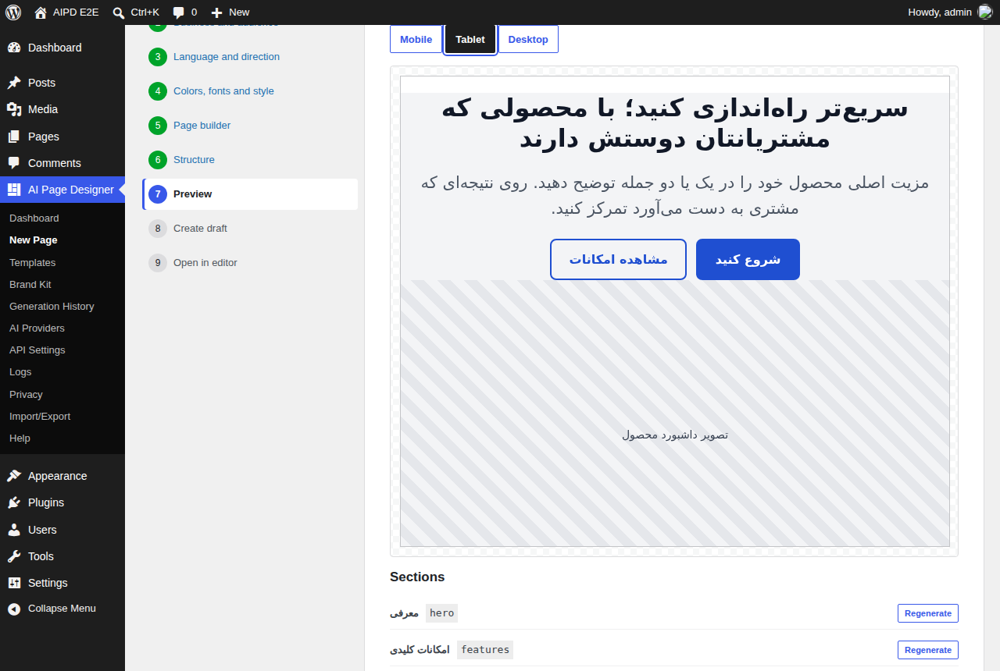

# AI Page Designer

A WordPress plugin that turns a written brief into an accessible, responsive **draft** page for the block editor, Elementor or the classic editor, using the AI service the site owner chooses.

The AI never writes HTML or code directly. It fills a strictly validated **Page Schema** (JSON), which the plugin sanitizes, checks for accessibility, and converts into native content for each page builder.

* **WordPress:** 6.6+ (tested with 6.6.2 and 7.1.2) · **PHP:** 7.4+ · **License:** GPL-2.0-or-later
* **Text domain:** `ai-page-designer` · **Translations:** English, Persian (fa_IR) · **RTL:** yes

<p align="center"></p>

## Features

* Nine-step wizard: page type → business and audience → language and direction → colors/fonts/style → page builder → editable structure → responsive preview → draft → editor.
* **Block editor first**: only core blocks, verified to load without invalid blocks in the real WordPress 6.6 and 7.1 editors; content stays editable if the plugin is deactivated.
* **Elementor** adapter through Elementor's public Documents API (containers or sections; Pro widgets only when Elementor Pro is active; no fatal error without Elementor).
* **Classic/HTML** adapter for every other theme or builder.
* **Providers**: any OpenAI-compatible Chat Completions API, or the WordPress 7.0+ AI Client (Connectors). Add more with one interface.
* **Accessibility**: single H1, heading order, WCAG AA contrast repair, alt text checks, keyboard-operable admin, axe-tested.
* **Multilingual/RTL**: content language independent of admin language; real mirrored RTL layouts; WPML/Polylang language assignment.
* **Security/privacy**: encrypted keys, SSRF protection, strict allowlists, shortcode neutralization, consent, per-request cost confirmation, rate limits, retention, exporter/eraser, opt-in uninstall cleanup. No tracking.

## Quick start (development)

```bash
composer install && npm install && npm run build
bash bin/install-wp-tests.sh 7.1.2 /tmp/aipd-wp          # WordPress + test library on SQLite
export WP_TESTS_DIR=/tmp/aipd-wp/wordpress-develop/tests/phpunit
export WP_TESTS_CONFIG_FILE_PATH=/tmp/aipd-wp/wp-tests-config.php
composer lint && composer test && npm run lint:js && npm run test:blocks
bash bin/build-zip.sh                                     # dist/ai-page-designer.zip
```

End-to-end tests: `bash bin/e2e-setup.sh` (starts a local site on port 8889) and `npm run test:e2e`.

## Documentation

| Document | Contents |
| --- | --- |
| [docs/product-analysis.md](docs/product-analysis.md) | MVP scope, roadmap, risks, WordPress.org compliance decisions, acceptance criteria |
| [docs/architecture.md](docs/architecture.md) | Components, data flow, Page Schema, interfaces, storage, capabilities, REST, jobs, UI/UX, tokens, RTL, accessibility |
| [docs/user-guide.md](docs/user-guide.md) | Installation, API setup, first page, troubleshooting |
| [docs/provider-development.md](docs/provider-development.md) | Writing an AI provider |
| [docs/page-builder-adapters.md](docs/page-builder-adapters.md) | Writing a page builder adapter |
| [docs/hooks.md](docs/hooks.md) | Actions and filters |
| [docs/rest-api.md](docs/rest-api.md) | REST endpoints |
| [docs/security.md](docs/security.md) | Threat model and controls |
| [docs/privacy.md](docs/privacy.md) | Stored and transmitted data, privacy tools |
| [docs/translation-and-rtl.md](docs/translation-and-rtl.md) | Translation workflow and RTL behavior |
| [docs/development.md](docs/development.md) | Tooling, tests, build and release |
| [docs/qa-report.md](docs/qa-report.md) | Test results for 1.0.0 |
| [docs/wordpress-org-checklist.md](docs/wordpress-org-checklist.md) | Submission checklist |
| [readme.txt](readme.txt) | WordPress.org readme (including External services) |
| [CHANGELOG.md](CHANGELOG.md) | Release notes |

## Repository layout

```
ai-page-designer.php   uninstall.php   readme.txt   LICENSE
includes/   PHP (PSR-4, own autoloader)      src/     wizard and admin JS sources
build/      compiled assets                  assets/  admin CSS
templates/  built-in Page Schema templates   languages/  POT, fa_IR
tests/      Unit, Integration, E2E, js       docs/    documentation
bin/        test environment, E2E setup, release ZIP
.wordpress-org/  directory banner, icon, screenshots
```
