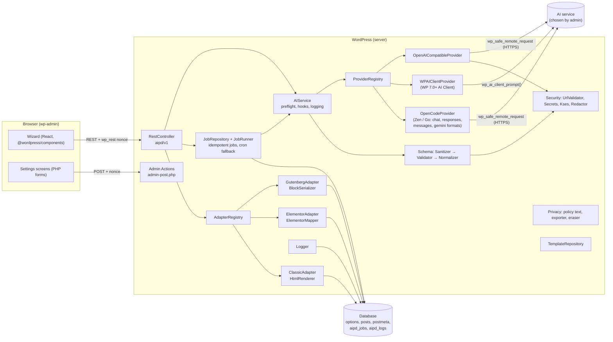
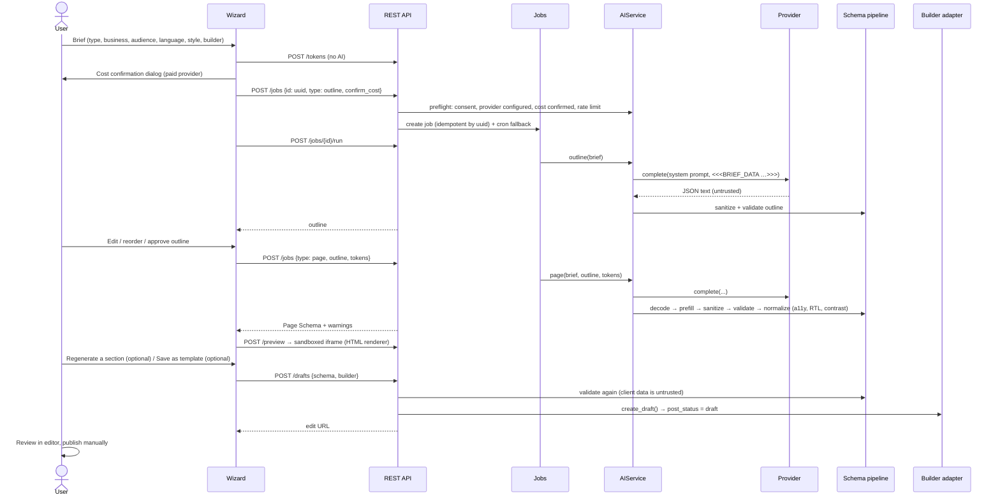
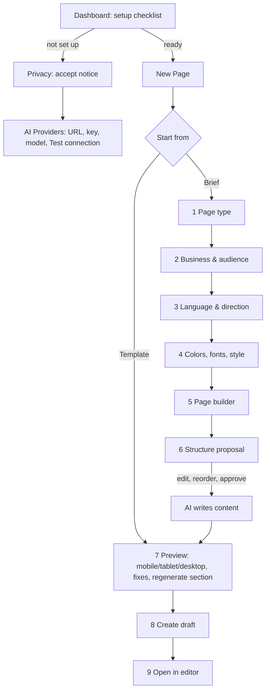

# Architecture

This document covers Phase 2 (architecture) and Phase 3 (UI/UX) of the AI Page Designer design.

## 1. Component diagram



The core (schema, security, jobs, REST) has no dependency on any page builder. Page builders and AI providers are plugged in through two interfaces and two registration actions.

## 2. Folder structure

```
ai-page-designer/
├── ai-page-designer.php          Plugin header, requirement check, bootstrap
├── uninstall.php                 Opt-in data removal (multisite aware)
├── readme.txt, LICENSE
├── includes/                     PSR-4 namespace AIPageDesigner\ (own autoloader, no Composer at runtime)
│   ├── Autoloader.php
│   ├── Core/                     Plugin (service wiring), Installer, Options, Capabilities, Frontend
│   ├── Admin/                    Admin (menu, assets), Pages (screens), Actions (form handlers)
│   ├── API/                      RestController (aipd/v1)
│   ├── AI/
│   │   ├── Contracts/            ProviderInterface
│   │   ├── DTO/                  Brief, CompletionRequest, CompletionResponse
│   │   ├── Providers/            AbstractProvider, OpenAICompatibleProvider, OpenCodeProvider, WPAIClientProvider
│   │   ├── AIService.php         Preflight + guarded send + outline/page/section flows
│   │   ├── PromptBuilder.php     System prompts and data boundary
│   │   ├── ProviderRegistry.php
│   │   └── RateLimiter.php
│   ├── PageBuilders/
│   │   ├── Contracts/            PageBuilderAdapterInterface
│   │   ├── Gutenberg/            GutenbergAdapter, BlockSerializer
│   │   ├── Elementor/            ElementorAdapter, ElementorMapper
│   │   ├── Classic/              ClassicAdapter, HtmlRenderer (also used for previews)
│   │   ├── AbstractAdapter.php, AdapterRegistry.php, Palette.php, StyleSheet.php
│   ├── Schema/                   PageSchema, Validator, Sanitizer, Normalizer, DesignTokens, SchemaService
│   ├── Security/                 UrlValidator (SSRF), Secrets (libsodium), Kses, Redactor
│   ├── Privacy/                  Privacy (policy text, exporter, eraser)
│   ├── Jobs/                     JobRepository, JobRunner
│   ├── Templates/                TemplateRepository
│   ├── Logging/                  Logger
│   └── Integrations/             Multilingual (WPML, Polylang)
├── src/                          Readable JS/SCSS sources (wizard, admin helpers)
├── build/                        Compiled assets (@wordpress/scripts)
├── assets/css/admin.css          Styles for server-rendered screens
├── templates/                    Built-in Page Schema templates (en LTR, fa RTL)
├── languages/                    POT, fa_IR PO/MO and JS JSON translations
└── tests/                        Unit, Integration, E2E (Playwright), js (block validation)
```

No custom block is registered: every component maps to core blocks, so `blocks/` is intentionally absent. A custom block would only be added if a component cannot be expressed with core blocks (for example a real form); the current design uses a clearly labeled placeholder instead.

## 3. Data flow



Key rules:

* The model never produces HTML documents, PHP, SQL or JavaScript; it can only fill the Page Schema.
* Every schema is re-validated on the server whenever it comes from the model, the browser, a template or an import.
* Drafts are always created with `post_status = draft`. Publishing uses the normal WordPress UI and capabilities.

## 4. Page Schema (v1.0)

The full JSON Schema is produced by `PageSchema::definition()` (and `PageSchema::to_json()`). Shape:

```json
{
  "schema_version": "1.0",
  "meta": { "title", "description", "language": "fa-IR", "direction": "rtl", "page_type": "landing", "style": "saas" },
  "design_tokens": {
    "colors": { "primary", "secondary", "accent", "text", "text_muted", "background", "surface", "on_primary" },
    "typography": { "heading_font", "body_font", "base_size", "scale", "line_height", "heading_weight" },
    "radius", "shadow", "section_spacing", "container_width",
    "breakpoints": { "mobile", "tablet" }
  },
  "sections": [
    {
      "id": "hero", "type": "hero", "label": "Introduction",
      "background": "default|surface|primary|accent|dark",
      "align": "start|center|end", "padding": "xs|sm|md|lg|xl",
      "layout": { "stack_on_mobile": true, "vertical_align": "top|center|bottom" },
      "intro": [ components shown above the columns ],
      "columns": [ { "width": 0, "style": "plain|card", "components": [ ... ] } ]
    }
  ]
}
```

Components: `heading`, `paragraph`, `buttons`, `list`, `image`, `icon`, `testimonial`, `faq`, `pricing`, `form`, `stat`, `spacer`, `separator`.

Sections map to containers, `columns` to columns, and components to widgets or blocks. Colors are never free-form in sections: a section chooses a background **token**, and the adapters derive accessible text and button colors (`Palette`).

Processing pipeline (`SchemaService::process()`):

1. **Decode**: extract one JSON object (code fences tolerated), size limit 256 KB.
2. **Prefill**: merge design tokens with the style preset, generate missing section ids, wrap flat component lists in a column.
3. **Sanitize** (`Sanitizer`): drop unknown properties and component types, apply `x-format` cleaning (`wp_kses` inline allowlist, link validation, hex colors, ids, language codes, font ids, emails), clamp numbers, truncate strings and arrays, use defaults for invalid enum values. Every repair becomes a warning.
4. **Validate** (`Validator`): strict JSON Schema check plus the `aipd_validate_schema` filter.
5. **Normalize** (`Normalizer`): direction from the content language, unique ids, one H1 and no skipped heading levels, WCAG AA contrast repair, alt text checks, media attachment verification.

## 5. Provider interface

```php
interface ProviderInterface {
	public function get_id();
	public function get_name();
	public function get_description();
	public function is_available();          // e.g. core API exists
	public function is_configured();         // e.g. key present: no request is sent otherwise
	public function is_paid();               // enables per-request cost confirmation
	public function get_settings_fields();   // rendered by the AI Providers screen
	public function get_public_settings();   // secrets reported only as is_set/from_constant
	public function save_settings( array $input );
	public function complete( CompletionRequest $request ); // CompletionResponse|WP_Error
	public function test_connection();
	public function get_privacy_info();      // service, terms_url, privacy_url, data_sent
}
```

See [provider-development.md](provider-development.md).

## 6. Page builder adapter interface

```php
interface PageBuilderAdapterInterface {
	public function get_id();
	public function get_name();
	public function is_available();                 // must never fatal
	public function get_supported_components();
	public function validate_schema( array $schema );
	public function render_page( array $schema );   // builder-native output
	public function create_draft( array $schema, array $args = array() );
	public function update_section( $post_id, array $schema, $section_id );
	public function get_edit_url( $post_id );
}
```

See [page-builder-adapters.md](page-builder-adapters.md).

## 7. Storage model

| Data | Where | Notes |
| --- | --- | --- |
| General settings | option `aipd_settings` (autoload) | provider choice, cost confirmation, rate limit, logging, retention, consent, uninstall choice |
| Provider settings (OpenAI-compatible, OpenCode, WP AI Client) | option `aipd_provider_settings` (not autoloaded) | API keys encrypted with libsodium (`aipd1:` prefix); key derived from WordPress salts or `AIPD_ENCRYPTION_KEY` |
| Brand kit | option `aipd_brand_kit` (not autoloaded) | colors, fonts, style, tone, default language, logo attachment |
| Jobs / history | table `{prefix}aipd_jobs` | uuid (idempotency key), user, type, status, brief, result, error, token usage, linked post. Brief and result are removed right after delivery when history is disabled |
| Logs | table `{prefix}aipd_logs` | level, event code, redacted message and context. Never prompts, output or keys |
| Generated page | post (`page` by default) | `post_content` (blocks or HTML), `_aipd_schema` (revisioned meta), `_aipd_builder`, `_aipd_generated`, `_aipd_css` |
| Elementor data | `_elementor_data` and related meta | written through Elementor's Documents API |
| User templates | private post type `aipd_template` + meta `_aipd_template_schema` | validated on save, load, import and export |
| Rate limit | transient `aipd_rl_{user}_{hour}` | object cache aware |

Revisions: section replacement uses `wp_update_post()`, so the previous version is available in the standard Revisions screen. `_aipd_schema` is registered with `revisions_enabled`.

## 8. Capabilities

| Capability | Default | Grants |
| --- | --- | --- |
| `aipd_manage_settings` | administrator | AI Providers, API Settings, Brand Kit, Privacy, Logs, Import/Export, deleting templates, viewing everyone's history |
| `aipd_generate_pages` | administrator | Wizard, templates, own history. Also requires `edit_pages` |
| Core `create_posts` / `edit_post` | per post type | creating drafts and replacing sections |
| Core `publish_pages` | unchanged | publishing (never done by the plugin) |

Multisite: super admins pass every check. Site administrators manage their site's settings unless the network defines `AIPD_NETWORK_MANAGED_SETTINGS` or filters `aipd_site_admins_can_manage_settings` to `false`, in which case `aipd_manage_settings` maps to `manage_network_options`. Network activation installs tables lazily per site on first admin visit and for new sites via `wp_initialize_site`.

## 9. REST endpoints

See [rest-api.md](rest-api.md) for parameters and responses.

| Method | Route | Permission |
| --- | --- | --- |
| GET | `/aipd/v1/status` | generate |
| GET, POST | `/aipd/v1/jobs` | generate |
| GET, DELETE | `/aipd/v1/jobs/{uuid}` | generate + owner (or manage) |
| POST | `/aipd/v1/jobs/{uuid}/run` | generate + owner (or manage) |
| POST | `/aipd/v1/schema/validate` | generate |
| POST | `/aipd/v1/preview` | generate |
| POST | `/aipd/v1/tokens` | generate |
| POST | `/aipd/v1/drafts` | generate + create_posts |
| GET | `/aipd/v1/drafts/{post}/schema` | generate + edit_post |
| PUT | `/aipd/v1/drafts/{post}/sections/{section}` | generate + edit_post |
| GET, POST | `/aipd/v1/templates` | generate |
| GET | `/aipd/v1/templates/{id}` | generate |
| DELETE | `/aipd/v1/templates/{id}` | manage |
| POST | `/aipd/v1/providers/{provider}/test` | manage |

## 10. Background processing

Generation can take up to a few minutes. Each request is a **job** identified by a client-generated UUID v4:

* `POST /jobs` performs every check and stores the job (same UUID returns the same job: idempotent).
* The wizard immediately calls `POST /jobs/{id}/run`, which runs the job in that request. An atomic `UPDATE … WHERE status = 'queued'` guarantees that only one runner executes it.
* If the browser disconnects or a proxy times out, a single WP-Cron event runs the job a minute later, and the wizard falls back to polling `GET /jobs/{id}`.
* Jobs left `running` for more than 10 minutes are marked `aipd_interrupted`.
* A daily cron applies the retention policy to jobs and logs.

---

# UI/UX (Phase 3)

## User flow



## Admin screens (text wireframes)

```
AI Page Designer ▸ Dashboard
┌─────────────────────────────┐ ┌─────────────────────────────┐
│ Setup                       │ │ Page builders               │
│ ✔ Data sharing reviewed     │ │ ✔ Block editor              │
│ ○ Provider configured [Fix] │ │ ○ Elementor — not active    │
│ [Create a new page]         │ │ ✔ Classic / HTML            │
└─────────────────────────────┘ └─────────────────────────────┘
┌───────────────────────────────────────────────────────────────┐
│ Recent requests  (date · title · type · status · tokens)      │
└───────────────────────────────────────────────────────────────┘

AI Page Designer ▸ New Page (wizard)
┌──────────────┐ ┌────────────────────────────────────────────┐
│ 1 Page type ●│ │ ## Structure                               │
│ 2 Business  ✔│ │ 1. [Hero        ][hero ▾]  Content & layout│
│ 3 Language  ✔│ │    [Up] [Down] [Remove]                    │
│ 4 Style     ✔│ │ 2. [Features    ][features ▾] …            │
│ 5 Builder   ✔│ │ [Add section]                              │
│ 6 Structure  │ │            [Back] [Propose again] [Approve]│
│ 7 Preview    │ └────────────────────────────────────────────┘
│ 8 Draft      │
│ 9 Editor     │   Preview step: [Mobile][Tablet][Desktop]
└──────────────┘   ┌─ sandboxed iframe ───────────────────────┐
                   │  rendered page (RTL or LTR)              │
                   └──────────────────────────────────────────┘
                   Sections: Hero [Regenerate] [Apply to page]
```

The step list collapses into a horizontally scrollable row below 960 px; all grids reflow to a single column on phones.

## States

| State | Implementation |
| --- | --- |
| Loading | `Busy` component: spinner plus a `role="status"` live message ("Designing the page structure…") |
| Progress | step indicator with done/current states; long jobs update the status text while polling |
| Empty | "No requests yet", "No templates found", "No log entries" |
| Error | `Notice` with a user-safe message, optional technical details (validation paths), and **Try again** |
| Success | success notices ("Section updated in the preview", "Your draft is ready") with next actions |
| Unsaved changes | `beforeunload` warning in the wizard and on settings forms |
| Not set up | warning notice with a direct link to the missing step; templates still usable |

## Design tokens

| Token | Default (Corporate) | Notes |
| --- | --- | --- |
| primary / secondary / accent | `#1f4fd1` / `#0f766e` / `#b45309` | brand colors; accent must carry `on_primary` text at 4.5:1 |
| text / text_muted | `#111827` / `#4b5563` | checked against background and surface |
| background / surface | `#ffffff` / `#f3f4f6` | alternating section backgrounds |
| on_primary | `#ffffff` | text on primary/accent bands |
| heading_font / body_font | `system-sans` | system stacks or theme.json font families; nothing is downloaded |
| base_size / scale / line_height | 17px / 1.25 / 1.6 | modular type scale |
| heading_weight | 700 | |
| radius | 8px | cards and buttons |
| shadow | none / soft / medium | cards |
| spacing scale | xs 16, sm 32, md 56, lg 80, xl 112 px | section padding |
| container_width | 1140px | 640–1440 |
| breakpoints | mobile 480, tablet 782 | preview and scoped CSS |

Seven presets: Corporate, Minimal, Creative, Luxury, SaaS, E-commerce, Editorial (`DesignTokens::preset()`), overridable with `aipd_design_tokens`.

## RTL and LTR behavior

* Content direction comes from the **content language**, not the admin language (`Normalizer::fix_direction()`), so a Persian page can be created from an English admin and vice versa.
* Block output: the page wrapper group gets `aipd-dir-rtl` / `aipd-dir-ltr`; alignment uses `start/center/end` in the schema and is mapped to physical values per direction (`end` → `left` in RTL).
* Elementor output: alignments are mirrored per direction; containers carry the direction class.
* HTML/preview output: `dir` and `lang` attributes on the wrapper and preview document.
* Admin CSS uses logical properties (`margin-inline`, `padding-inline`, `inset-inline-end`, `border-inline-start`), so the same stylesheet serves RTL and LTR admins.

## Accessibility criteria

* WCAG 2.2 AA color contrast for text on every background token (automatic repair).
* One H1 per page, no skipped heading levels, labeled sections (`aria-label` when supported).
* Informative images need alt text; decorative images get empty alt; icon glyphs are `aria-hidden`.
* Visible focus styles (`:focus-visible`) in generated pages and the admin.
* Wizard: native form controls with labels, radio groups in fieldsets with legends, focus moved to the step heading when the step changes, live regions for progress, `aria-pressed` on preview size buttons, keyboard-only operation.
* Respects `prefers-reduced-motion`.
* Verified with axe-core (WCAG 2.0/2.1/2.2 A and AA rules) in the E2E suite for all admin screens and generated pages.
